# Docusage Architecture Specification 🏛️

This document provides an exhaustive technical specification of **Docusage**, an enterprise-grade multi-agent contract compliance and legal risk assessment engine. It covers system topology, the LangGraph state machine, dense vector retrieval mechanics, ingestion pipelines, observability, and containerized deployment.

---

## 1. System Overview & Monorepo Topology

Docusage is architected as an isolated monorepo separating high-throughput Python AI/backend operations from modern React/Next.js frontend workflows:

```
docusage/
├── backend/                       # Python 3.12 FastAPI & LangGraph AI Service
│   ├── Dockerfile                 # Isolated backend container build
│   ├── .dockerignore              # Cache and volume exclusions
│   ├── requirements.txt           # Production Python dependencies
│   ├── pytest.ini                 # Backend-specific Pytest configuration
│   ├── src/backend/
│   │   ├── agents/
│   │   │   ├── analyzer.py        # LangGraph StateGraph, nodes, HITL engine
│   │   │   └── retriever.py       # Clause search & vector query interface
│   │   ├── app/
│   │   │   ├── main.py            # FastAPI entry point, lifespan, & routes
│   │   │   ├── config.py          # Pydantic BaseSettings environment config
│   │   │   ├── routes/            # contracts, policies, metrics endpoints
│   │   │   ├── services/          # Business logic (CRUD, RAG, file processing)
│   │   │   ├── models/            # Pydantic schemas (Request/Response)
│   │   │   └── utils/             # DB pooling, helpers, logging, metrics, tracking
│   │   └── worker/
│   │       ├── celery_app.py      # Celery broker & result backend initialization
│   │       └── tasks.py           # Ingestion tasks (chunking & embeddings)
│   └── tests/                     # 32 Pytest, Hypothesis, and CRUD test suites
│
├── frontend/                      # Next.js 14 (App Router) TypeScript Client
│   ├── Dockerfile                 # Multi-stage production container build
│   ├── .dockerignore              # Node module and cache exclusions
│   ├── package.json               # Next.js, React 18, Tailwind, Vitest, Playwright
│   ├── tailwind.config.ts         # Titanium & Zinc theme design tokens
│   ├── tsconfig.json
│   ├── vitest.config.ts
│   ├── src/
│   │   ├── app/                   # App Router pages (/contracts, /policies, /evals)
│   │   ├── components/            # Layout, Reviewer, Dashboard, and Ingestion UI
│   │   ├── lib/                   # Typed API client (api.ts) & utility helpers
│   │   └── types/                 # TypeScript interfaces
│   └── tests/                     # Vitest unit tests + Playwright browser flows
│
├── scripts/
│   └── setup_db.sql               # PostgreSQL pgvector schema and seed policies
├── data/                          # Persistent raw contract storage (volume-mounted)
├── docker-compose.yml             # Orchestration for all 5 containerized services
└── pytest.ini                     # Root runner pointing pythonpath to backend
```

---

## 2. End-to-End Execution Flow

The sequence diagram below illustrates the full lifecycle from contract document ingestion to LangGraph audit, human-in-the-loop breakpoint, and final evaluation persistence:

```mermaid
sequenceDiagram
    autonumber
    actor Counsel as Legal Counsel
    participant FE as Next.js Frontend
    participant API as FastAPI Gateway
    participant Celery as Celery Worker
    participant DB as PostgreSQL (pgvector)
    participant LG as LangGraph Engine
    participant MLflow as MLflow / Prometheus

    Counsel->>FE: Upload Contract (PDF / DOCX / TXT)
    FE->>API: POST /contracts/upload
    API->>DB: INSERT INTO contracts (name, file_path, metadata)
    API->>Celery: enqueue ingest_contract_task(contract_id, file_path)
    API-->>FE: Return ContractResponse (ID: 42)

    Note over Celery,DB: Asynchronous Background Ingestion
    Celery->>Celery: Extract Text (pdfplumber / docx)
    Celery->>Celery: Clean & Chunk Text (512 chars)
    Celery->>Celery: Generate 768-d Embeddings (all-mpnet-base-v2)
    Celery->>DB: INSERT INTO clauses (contract_id, text, embedding)

    Counsel->>FE: Start Analysis against Policy
    FE->>API: POST /contracts/42/graph/start/1?thread_id=t-101
    API->>LG: ContractAnalysisEngine.start_review(42, 1, "t-101")
    
    rect rgb(30, 30, 40)
        Note over LG: Autonomous Phase
        LG->>LG: retriever_node: Query top-k clauses per policy rule
        LG->>DB: SELECT text FROM clauses ORDER BY embedding <=> query LIMIT 2
        LG->>LG: auditor_node: Calculate deviations & Risk Score
        alt Risk Score <= 0.3
            LG->>LG: finalizer_node (Auto-Approve)
        else Risk Score > 0.3
            LG->>LG: Pause at breakpoint (interrupt_before=["human_review"])
        end
    end

    LG-->>API: Return Snapshot (is_interrupted: true, state)
    API-->>FE: Return AnalysisSession
    FE-->>Counsel: Render Split-Screen Reviewer & Highlight Deviations

    Counsel->>FE: Review Deviations & Click 'Revise' with Instructions
    FE->>API: POST /contracts/graph/t-101/review { action: 'revise', feedback: '...' }
    API->>LG: ContractAnalysisEngine.submit_human_decision("t-101", "revise", feedback)

    rect rgb(30, 30, 40)
        Note over LG: Iteration & Concession Loop
        LG->>LG: refine_node: Apply counsel feedback discount
        LG->>LG: auditor_node: Recompute adjusted risk score
        LG->>LG: finalizer_node: Set APPROVED_BY_LEGAL or REJECTED
    end

    LG->>DB: INSERT INTO evals (compliance_score, risk_score)
    LG->>MLflow: track_contract_evaluation() & Prometheus.inc()
    LG-->>API: Return Finalized State
    API-->>FE: Return Updated Session
    FE-->>Counsel: Update Reviewer UI to Final Status
```



---

## 3. Multi-Agent LangGraph State Machine

The core compliance auditing intelligence is implemented using **LangGraph 1.2+** as a deterministic, check-pointed state machine.

### 3.1 State Schema (`ContractAnalysisState`)

```python
class ContractAnalysisState(TypedDict):
    contract_id: int                         # Unique database ID of the target contract
    policy_id: int                           # Target policy definition being audited
    thread_id: str                           # Isolated session checkpoint identifier
    rules: List[Dict[str, Any]]              # Policy covenants evaluated
    retrieved_clauses: Dict[str, List[str]]  # Semantic clauses mapped per rule
    deviations: List[Dict[str, Any]]         # Identified missing or non-compliant clauses
    risk_score: float                        # Calculated risk metric (0.0 to 1.0)
    status: str                              # Current state node tag
    human_action: Optional[str]              # 'approve' | 'reject' | 'revise' | None
    human_feedback: Optional[str]            # Guidance provided by legal counsel
    iteration_count: int                     # Number of refinement loops executed
    max_iterations: int                      # Upper boundary to prevent infinite looping
```

### 3.2 StateGraph Node Topology & Transitions


### 3.3 Node Specifications

1. **`retriever_node`**:
   - Queries policy rules from PostgreSQL `policies` table (or uses baseline defaults if unconfigured).
   - Iterates through each rule query and invokes `retrieve_relevant_clauses(query, contract_id, top_k=2)` via vector similarity search.
   - Populates `retrieved_clauses` dictionary. Sets status to `"retrieved"`.

2. **`auditor_node`**:
   - Evaluates retrieved clauses against each rule threshold.
   - Flags missing or sub-threshold clauses as `HIGH` risk deviations with explanatory rationale.
   - Calculates baseline risk score:
     $$\text{Risk Score} = \frac{\text{Total Rules} - \text{Satisfied Rules}}{\text{Total Rules}}$$
   - If previous human counsel feedback requested revisions with concessions, applies a discount factor ($\max(0.0, \text{Risk} - 0.2)$).
   - Increments `iteration_count`. Sets status to `"audited"`.

3. **`should_require_human_review` (Conditional Edge)**:
   - Checks if `risk_score > 0.3` and `iteration_count <= max_iterations`.
   - If true, routes to `"human_review"`.
   - If false (contract is low-risk), routes directly to `"finalize"` for automatic approval.

4. **`human_review_node` (Interruption Breakpoint)**:
   - Configured with `interrupt_before=["human_review"]`.
   - LangGraph checkpoints state in `MemorySaver` using `thread_id` and suspends thread execution.
   - Execution halts until legal counsel reviews the findings and invokes `submit_human_decision()`.

5. **`route_human_decision` (Conditional Edge)**:
   - If `human_action == "revise"` and `iteration_count < max_iterations`, routes to `"refine"`.
   - If `human_action` is `"approve"` or `"reject"`, routes to `"finalize"`.

6. **`refinement_node`**:
   - Updates graph context with counsel-provided remediation guidance (`human_feedback`).
   - Routes back to `auditor_node` for iterative re-audit.

7. **`finalizer_node`**:
   - Determines final status:
     - `APPROVED_BY_LEGAL` (Compliance score $\ge 0.9$)
     - `REJECTED_BY_LEGAL` (Compliance score = $0.0$)
     - `AUTO_COMPLETED` (Compliance score = $1.0 - \text{Risk Score}$)
   - Persists metrics to database (`evals` table).
   - Increments Prometheus counter: `contract_evaluations_total.labels(status=final_status).inc()`.
   - Logs experiment parameters and metrics to MLflow via `track_contract_evaluation()`.

---

## 4. Document Ingestion & Vector Storage Pipeline

### 4.1 Multi-Format Extraction
- **PDF Documents**: Parsed with `pdfplumber`. Extracts text while preserving tables (formatted as structured markdown tables) to prevent clause boundary truncation.
- **DOCX Documents**: Parsed with `python-docx`. Iterates paragraphs and table cells sequentially.
- **Plain Text / Code**: Read directly using UTF-8 decoding with fallback error replacement.

### 4.2 Normalization & Chunking
- **Text Cleaning (`clean_text`)**: Idempotent regex normalization that strips control characters, non-alphanumeric noise, and collapses irregular whitespaces.
- **Sliding Window Chunking (`chunk_text`)**: Recursively divides normalized text into 512-character blocks with deterministic word-boundary boundaries.

### 4.3 Embedding Model & Dense Vector Dimensions
- Uses **Sentence Transformers** `all-mpnet-base-v2` (`768` dimensions).
- Produces normalized dense vectors optimized for semantic similarity in commercial contract clauses.

### 4.4 PostgreSQL `pgvector` Schema & Cosine Distance Search

```sql
CREATE EXTENSION IF NOT EXISTS vector;

CREATE TABLE IF NOT EXISTS contracts (
    id SERIAL PRIMARY KEY,
    name VARCHAR(255) NOT NULL,
    file_path VARCHAR(255) NOT NULL,
    metadata JSONB,
    created_at TIMESTAMP DEFAULT NOW()
);

CREATE TABLE IF NOT EXISTS clauses (
    id SERIAL PRIMARY KEY,
    contract_id INTEGER REFERENCES contracts(id) ON DELETE CASCADE,
    text TEXT NOT NULL,
    clause_type VARCHAR(100),
    entities JSONB,
    embedding vector(768)
);

CREATE TABLE IF NOT EXISTS policies (
    id SERIAL PRIMARY KEY,
    name VARCHAR(255) NOT NULL,
    rules JSONB
);

CREATE TABLE IF NOT EXISTS evals (
    id SERIAL PRIMARY KEY,
    contract_id INTEGER REFERENCES contracts(id) ON DELETE CASCADE,
    metric_name VARCHAR(100) NOT NULL,
    value FLOAT NOT NULL,
    timestamp TIMESTAMP DEFAULT NOW()
);
```

#### Native Vector Query
Clauses are retrieved using native pgvector cosine distance:
```sql
SELECT text 
FROM clauses 
WHERE contract_id = %s 
ORDER BY embedding <=> %s::vector 
LIMIT %s;
```

#### Zero-Downtime NumPy Fallback
If the database vector operator is temporarily unreachable, `retrieve_relevant_clauses` automatically rolls back the cursor, fetches raw float arrays from `clauses`, and computes in-memory cosine similarities:
$$\text{Sim}(\vec{u}, \vec{v}) = \frac{\vec{u} \cdot \vec{v}}{\|\vec{u}\| \|\vec{v}\|}$$

---

## 5. Policy Specification & Governance Rules

Corporate policies are defined as JSONB arrays of covenant rules. Each rule encapsulates:
- `name`: Human-readable covenant label (e.g., `"Limitation of Liability Cap"`).
- `query`: Target semantic search query vector matching related contract clauses.
- `threshold`: Cosine similarity confidence cutoff (e.g., `0.80`).

### Default Seed Policy: `Standard Enterprise Policy 2026`
```json
[
  {
    "name": "Limitation of Liability Cap",
    "query": "limitation of liability cap aggregate liability",
    "threshold": 0.80
  },
  {
    "name": "Governing Law (New York)",
    "query": "governing law jurisdiction New York",
    "threshold": 0.85
  },
  {
    "name": "Mutual Indemnification",
    "query": "indemnify hold harmless mutual third party claims",
    "threshold": 0.75
  }
]
```

---

## 6. Frontend Architecture & Design System

The frontend is built with Next.js 14 App Router and TypeScript, styled with a **Clinical Minimalism (Titanium & Zinc)** aesthetic generated via StitchMCP.

### 6.1 Theme & Color Palette
- **Canvas Base**: `#09090b` (Zinc-950)
- **Surface Elevation**: `#18181b` (Zinc-900)
- **Subtle Borders**: `#27272a` (Zinc-800)
- **Primary Typography**: `#f4f4f5` (Zinc-100)
- **Muted Typography**: `#71717a` (Zinc-500)
- **Accent Highlighting**: Titanium Gold (`#d97706` / `#fbbf24`) for deviations; Zinc Emerald (`#10b981`) for compliance.

### 6.2 Reviewer Workbench Components
- **`DocumentViewer.tsx`**: Left split-pane displaying contract text with color-coded clause deviation bounding highlights.
- **`PolicyInspector.tsx`**: Right split-pane visualizing live LangGraph state machine status, circular risk score gauge, and evaluated covenants checklist.
- **`DecisionDock.tsx`**: Floating bottom action dock providing counsel with instantaneous review actions:
  - **Approve**: Immediately transitions state to `APPROVED_BY_LEGAL` (Score: 0.9+).
  - **Request Revision / Iterate**: Unfurls counsel feedback input, resumes LangGraph to `refine` node, and recalculates risk.
  - **Reject**: Transitions state to `REJECTED_BY_LEGAL` (Score: 0.0).

---

## 7. Observability, Metrics & Telemetry

### 7.1 Prometheus Metrics Exposition (`GET /metrics`)
Implemented via `prometheus_client` and mounted directly into the FastAPI application:
- `http_requests_total` (Counter, labels: `endpoint`, `method`, `status`): Tracks request volume and API failure rates.
- `contract_evaluations_total` (Counter, labels: `status`): Tracks audits completed by outcome (`AUTO_COMPLETED`, `APPROVED_BY_LEGAL`, `REJECTED_BY_LEGAL`).
- `rag_search_duration_seconds` (Histogram): Measures execution latency of semantic clause retrieval across PostgreSQL and NumPy fallbacks.

### 7.2 MLflow Experiment Tracking
Integrated via `src/backend/app/utils/tracking.py`:
- Logs every evaluation run under the experiment `"docusage-contract-analysis"`.
- Records parameters: `contract_id`, `policy_id`, `final_status`, `human_action`, `deviations_count`.
- Records metrics: `compliance_score`, `risk_score`, `iteration_count`.
- Handles unreachable MLflow server gracefully without crashing the core review pipeline.

---

## 8. Containerization & Deployment Orchestration

### 8.1 Service Network Topology

```
                  Host Network
             ┌─────────────────────┐
             │ Port 3000   Port 8000
             └──────┬──────────┬───┘
                    │          │
┌───────────────────┼──────────┼──────────────────────────────┐
│ Docker Network:   │          │  (docusage_default)          │
│                   ▼          ▼                              │
│             ┌──────────┐   ┌──────────┐                     │
│             │ frontend │   │ backend  │                     │
│             └──────────┘   └────┬─────┘                     │
│                                 │                           │
│                      ┌──────────┴──────────┐                │
│                      │                     │                │
│                      ▼                     ▼                │
│                 ┌─────────┐           ┌─────────┐           │
│                 │ celery  │           │  redis  │           │
│                 └────┬────┘           └─────────┘           │
│                      │                     ▲                │
│                      │                     │                │
│                      ▼                     │                │
│                 ┌──────────┐               │                │
│                 │ postgres │───────────────┘                │
│                 │(pgvector)│                                │
│                 └──────────┘                                │
└─────────────────────────────────────────────────────────────┘
```

### 8.2 Healthcheck & Dependency Orchestration
- **Postgres Healthcheck**: Runs `pg_isready -U docusage -d docusage` every 5s.
- **Redis Healthcheck**: Runs `redis-cli ping` every 5s.
- **Backend & Celery**: Configured with `depends_on: { postgres: { condition: service_healthy }, redis: { condition: service_healthy } }` to eliminate race conditions during cold starts.
- **Database Initialization**: Auto-mounts [`scripts/setup_db.sql`](file:///home/gagan-ahlawat/Projects/docusage/scripts/setup_db.sql) to `/docker-entrypoint-initdb.d/init.sql:ro` ensuring extensions and tables exist before application startup.
