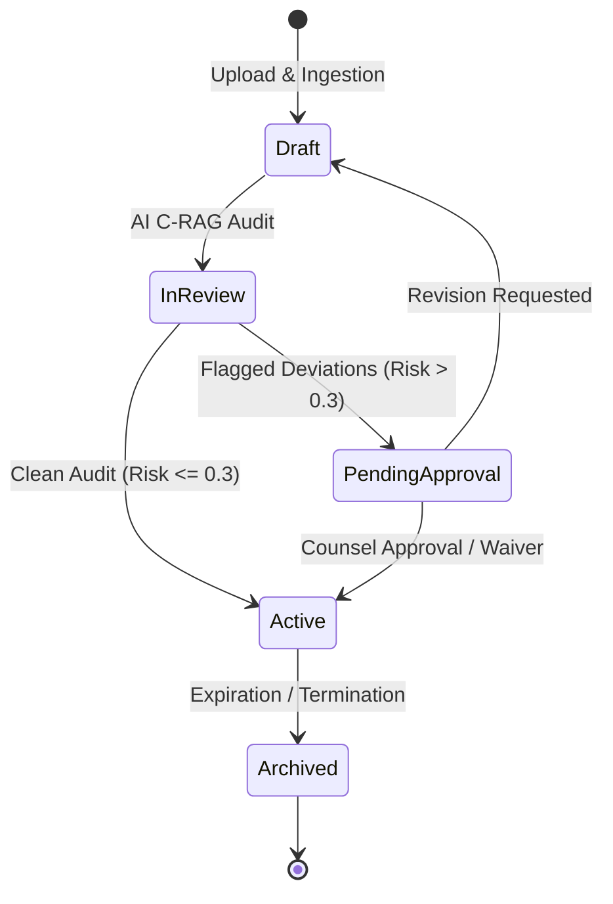
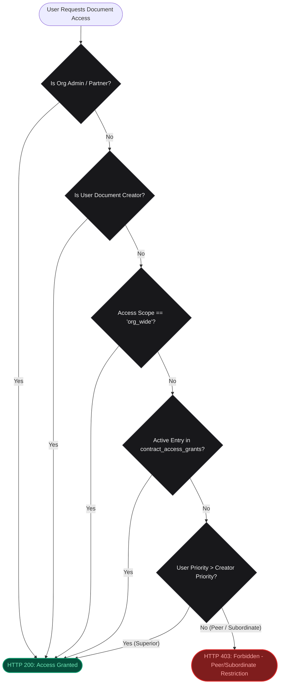
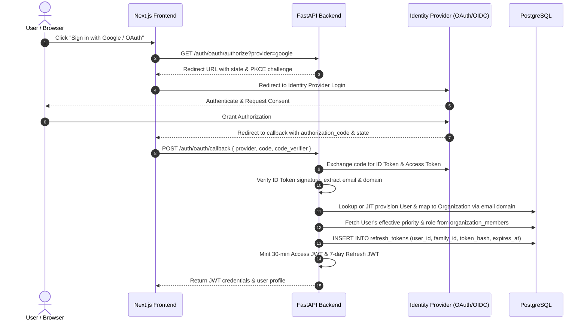
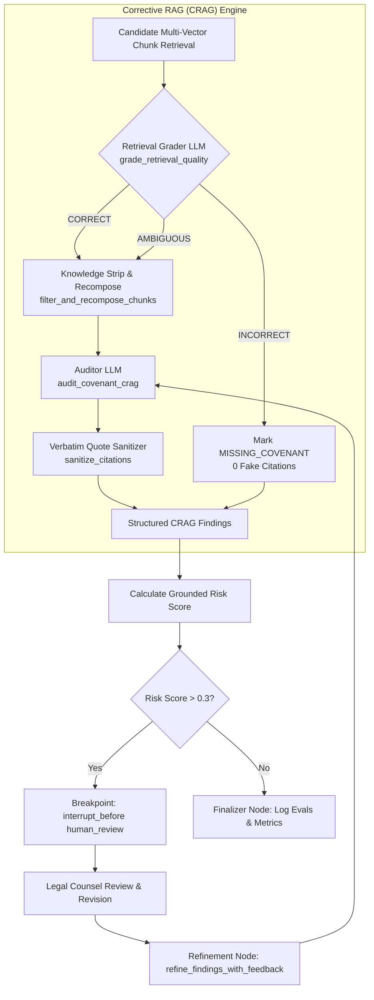

# Docusage Architecture Specification 🏛️

This document provides a comprehensive technical architecture specification of **Docusage**, an enterprise-grade legal document management, compliance risk assessment, and hierarchical security platform. It details the document lifecycle management phases, multi-tenant organization structure, OAuth 2.0 / OIDC integration, the mathematical Priority-Based RBAC engine, the Multi-Agent Corrective RAG (C-RAG) pipeline, and the LangGraph state machine.

---

## 1. System Overview & Monorepo Topology

Docusage is architected as an isolated monorepo separating high-throughput Python AI/backend operations from modern React/Next.js frontend workflows:

```
docusage/
├── backend/                       # Python 3.12 FastAPI & LangGraph AI Service
│   ├── Dockerfile                 # Isolated backend container build
│   ├── pytest.ini                 # Backend Pytest configuration
│   ├── requirements.txt           # Production Python dependencies
│   ├── src/backend/
│   │   ├── agents/
│   │   │   ├── analyzer.py        # LangGraph StateGraph, nodes, HITL engine
│   │   │   └── retriever.py       # Clause search & vector query interface
│   │   ├── app/
│   │   │   ├── main.py            # FastAPI entry point, lifespan, & routes
│   │   │   ├── config.py          # Pydantic BaseSettings environment config
│   │   │   ├── routes/            # auth, admin, contracts, policies, settings, metrics
│   │   │   ├── services/          # auth, rbac, crag, contracts, policies, provider_manager
│   │   │   ├── models/            # Pydantic schemas (Request/Response)
│   │   │   └── utils/             # jwt, security (AES-256), db, logging, metrics, tracking
│   │   └── worker/
│   │       ├── celery_app.py      # Celery broker & result backend initialization
│   │       └── tasks.py           # Ingestion tasks (chunking & parent-child embeddings)
│   └── tests/                     # Pytest, Hypothesis property tests, and CRUD test suites
│
├── frontend/                      # Next.js 16 (App Router) TypeScript Client
│   ├── Dockerfile                 # Multi-stage production container build
│   ├── package.json               # Next.js, React 19, Tailwind, Vitest
│   ├── tailwind.config.ts         # Titanium & Zinc theme design tokens
│   ├── src/
│   │   ├── app/                   # App Router pages (/login, /admin/roles, /contracts, /policies, /evals)
│   │   ├── components/            # Layout, Reviewer, AccessGrantModal, SettingsModal, DecisionDock
│   │   ├── lib/                   # Typed API client (api.ts) & utility helpers
│   │   └── types/                 # TypeScript interfaces
│   └── tests/                     # Unit tests & auth/admin workflows
│
├── scripts/
│   ├── setup_db.sql               # PostgreSQL pgvector schema, roles, members, grants, seed
│   └── migrate_to_multi_vector.py # Multi-vector migration script
├── data/                          # Persistent raw document storage
├── docker-compose.yml             # Container orchestration
├── pytest.ini                     # Root runner configuration
└── ARCHITECTURE.md           # Master technical specification
```

---

## 2. Document Management & Lifecycle Phases 📄

Docusage enables individuals and organizations to manage their legal documents (contracts, NDAs, MoUs, compliance policies, Master Service Agreements) through five structured lifecycle phases:



### 2.1 Lifecycle Phase Specifications

| Phase | Identifier | Key Operations & System Behavior |
| :--- | :--- | :--- |
| **1. Draft** | `DRAFT` | Document uploaded by user; metadata extracted; text converted to parent-child multi-vector chunks; initial policy classification executed. |
| **2. In Review** | `IN_REVIEW` | Automated Corrective RAG (C-RAG) pipeline audits chunks against policy covenants, grades retrieval quality, identifies risk deviations, and verifies verbatim quotes. |
| **3. Pending Approval** | `PENDING_APPROVAL` | High-risk documents ($ \text{Risk Score} > 0.3 $) trigger a LangGraph Human-in-the-Loop (`interrupt_before`) breakpoint for legal counsel review, redlining, or waiver submission. |
| **4. Active / Executed** | `ACTIVE` | Document approved by counsel; contract enforced; continuous compliance monitoring enabled; expiration & renewal tracking active. |
| **5. Archived** | `ARCHIVED` | Document expired or superseded; moved to immutable read-only legal archive with preserved audit trails. |

---

## 3. Hierarchical Priority-Based RBAC Engine 🛡️

Docusage implements a mathematical, seniority-driven access control model where an employee's organizational priority score governs document access, supplemented by granular delegation overrides.

### 3.1 Mathematical Access Control Model

For any user $u$ requesting access to document $c$ created by employee $u_{\text{creator}}$:

$$\text{CanView}(u, c) \iff \begin{cases} 
\text{True} & \text{if } u.\text{is\_admin} = \text{True} \lor u.\text{role} \in \{\text{"Partner"}, \text{"Admin"}, \text{"Owner"}\} \\
\text{True} & \text{if } u.\text{id} = c.\text{created\_by\_user\_id} \\
\text{True} & \text{if } c.\text{access\_scope} = \text{"org\_wide"} \\
\text{True} & \text{if } \exists g \in \text{Grants}(c, u) \text{ where } g.\text{expires\_at} > \text{now}() \\
\text{True} & \text{if } u.\text{priority} > u_{\text{creator}}.\text{priority} \\
\text{False} & \text{otherwise (HTTP 403 Forbidden - Peer & Subordinate Protection)}
\end{cases}$$

### 3.2 Formal Security Invariants (Verified via Hypothesis Property Tests)

1. **Subordinate Visibility (Top-Down):** Employee $A$ with priority $P_A$ can view all documents created by subordinates having priority $P_{\text{sub}} < P_A$.
2. **Superior Visibility:** All documents created by Employee $A$ ($P_A$) are visible to superiors having priority $P_{\text{sup}} > P_A$.
3. **Peer & Subordinate Protection:** Documents created by Employee $A$ are **strictly invisible** to any employee having priority equal to $P_A$ ($P_{\text{peer}} = P_A$, where user $\neq A$) or less than $P_A$ ($P_{\text{sub}} < P_A$).
4. **Explicit Delegation Override:** Contract creators or superiors can issue explicit time-bound grants (`contract_access_grants`) allowing specific junior or peer employees access, which can be revoked at any time.
5. **Admin Universal Access:** Administrators and Managing Partners maintain universal read/write/audit permissions across all organization documents regardless of seniority scores.



---

## 4. Organization Management & OAuth 2.0 / OIDC Architecture 🏢🔑

### 4.1 Multi-Tenant Organization Structure

Docusage supports multi-tenant organization management with isolated domain boundaries:

- `organizations`: Stores tenant metadata, domain whitelist (e.g. `@lawfirm.com`), and OAuth provider configuration.
- `organization_roles`: Defines custom roles per organization with assigned numeric priorities (e.g., Managing Partner = 100, Senior Counsel = 80, Associate = 50, Paralegal = 20).
- `organization_members`: Maps users to organizations, linking `role_id` and optional `custom_priority_override`.

### 4.2 OAuth 2.0 / OpenID Connect (OIDC) Integration

Docusage supports OAuth 2.0 / OIDC identity providers (Google Workspace, Microsoft Entra ID / Azure AD, GitHub, Okta SSO) alongside passwordless OTP delivery.



### 4.3 Dual-Token Security & Token Family Rotation

| Token Type | Lifespan (TTL) | Payload Claims | Storage & Tracking |
| :--- | :--- | :--- | :--- |
| **Access Token** | **30 Minutes** (`1800s`) | `sub`, `email`, `org_id`, `role`, `priority`, `is_admin`, `type: "access"`, `iat`, `exp`, `jti` | Stateless Bearer header in client memory |
| **Refresh Token** | **7 Days** (`604800s`) | `sub`, `family_id`, `type: "refresh"`, `iat`, `exp`, `jti` | PostgreSQL `refresh_tokens` table |

**Replay Attack Defense:** Every refresh token exchange (`POST /auth/refresh`) invalidates the consumed refresh token and issues a new pair within the same `family_id`. If a revoked token is reused, Docusage revokes the entire `family_id`.

---

## 5. Multi-Agent Corrective RAG (C-RAG) & LangGraph State Machine 🤖

Compliance auditing is driven by **LangGraph 1.2+** as a check-pointed state machine combined with a **Corrective RAG (CRAG)** grading and citation engine.

### 5.1 C-RAG Implementation Update & Components



### 5.2 C-RAG Pipeline Mechanics

1. **Retrieval Quality Grading (`grade_retrieval_quality`):** Evaluates retrieved document chunks per policy rule and assigns a grade of `CORRECT`, `AMBIGUOUS`, or `INCORRECT` along with confidence scores.
2. **Knowledge Strip-and-Recompose (`filter_and_recompose_chunks`):** Filters out noise chunks before passing text to the auditor model.
3. **Grounded Compliance Audit (`audit_covenant_crag`):** Audits policy covenants against filtered chunks, outputting structured findings (`SATISFIED`, `DEVIATION`, or `MISSING_COVENANT`).
4. **Verbatim Quote Sanitizer (`sanitize_citations`):** Enforces a **Zero-Hallucination Invariant** by verifying that all cited quotes exist verbatim within the original document chunks.
5. **Counsel Feedback & Refinement (`refine_findings_with_feedback`):** Synthesizes legal counsel revision feedback, applies waivers (`WAIVED_BY_COUNSEL`), and recalculates risk scores.

### 5.3 LangGraph State Schema (`ContractAnalysisState`)

```python
class ContractAnalysisState(TypedDict):
    contract_id: Union[str, int]                      # Database UUID of target contract/document
    policy_id: int                                    # Target compliance policy ID
    thread_id: str                                    # Isolated session checkpoint ID
    rules: List[Dict[str, Any]]                       # Policy rules being audited
    retrieved_clauses: Dict[str, List[str]]           # Semantic text clauses retrieved
    candidate_chunks: Dict[str, List[Dict[str, Any]]] # Multi-vector chunk metadata
    crag_findings: List[Dict[str, Any]]               # Structured C-RAG findings & grades
    citations: List[Dict[str, Any]]                   # Verbatim extracted quotes
    deviations: List[Dict[str, Any]]                  # Identified missing or non-compliant clauses
    risk_score: float                                 # Overall document risk metric (0.0 to 1.0)
    status: str                                       # Current state tag
    human_action: Optional[str]                       # 'approve' | 'reject' | 'revise' | None
    human_feedback: Optional[str]                     # Guidance provided by legal counsel
    iteration_count: int                              # Number of refinement loops executed
    max_iterations: int                               # Loop safety boundary (default = 3)
```

---

## 6. Multi-Vector Ingestion & Vector Retrieval 🔍

Docusage uses a **Parent-Child Multi-Vector Indexing Architecture**:

1. **Parent Document Sections:** Large contextual section blocks (500–1500 tokens) preserved for holistic LLM context during audit nodes.
2. **Child Clauses:** Granular sub-clauses (100–300 tokens) embedded using dense vector representations (`sentence-transformers/all-MiniLM-L6-v2`) and indexed via PostgreSQL `pgvector` (`HNSW` index).
3. **Hybrid Search:** Combines dense vector similarity with sparse BM25 keyword matching for optimal recall.

---

## 7. Containerized Infrastructure & Operational Stack 🐳

```
+-----------------------------------------------------------------------+
|                            Next.js 16 Client                          |
|                       (React 19 + Tailwind CSS)                       |
+-----------------------------------+-----------------------------------+
                                    | REST / JSON
                                    v
+-----------------------------------------------------------------------+
|                         FastAPI Backend App                           |
|              (LangGraph 1.2+ StateMachine, C-RAG, RBAC)                |
+-----------------+-----------------+-------------------+---------------+
                  |                 |                   |
                  v                 v                   v
        +------------------+ +-------------+ +--------------------+
        |  PostgreSQL 16   | | Redis Broker| | Celery Ingestion   |
        | (pgvector DB)    | | (Celery /   | | Worker (Parent     |
        |                  | |  PubSub)    | | Chunk Embeddings)  |
        +------------------+ +-------------+ +--------------------+
```

- **Databases:** PostgreSQL 16 with `pgvector` extension.
- **Cache & Message Broker:** Redis.
- **Background Ingestion:** Celery workers with Redis broker.
- **Observability:** Prometheus metrics (`/metrics`) and structured JSON logging.
