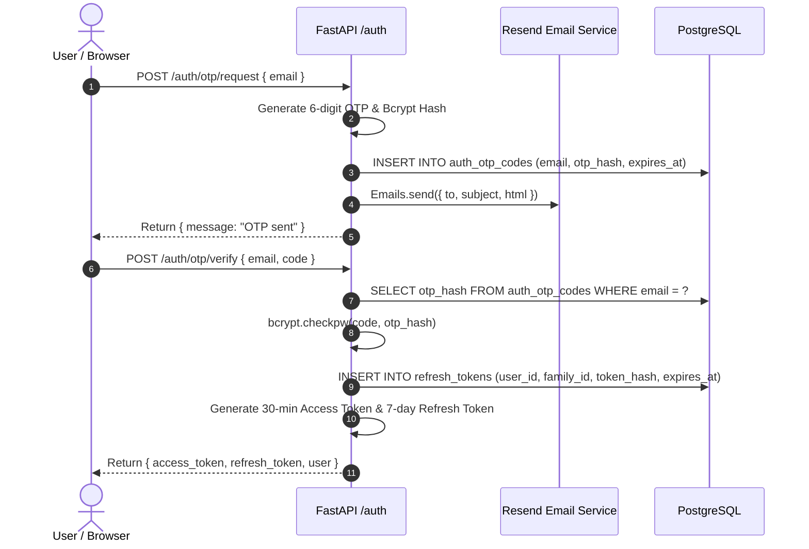
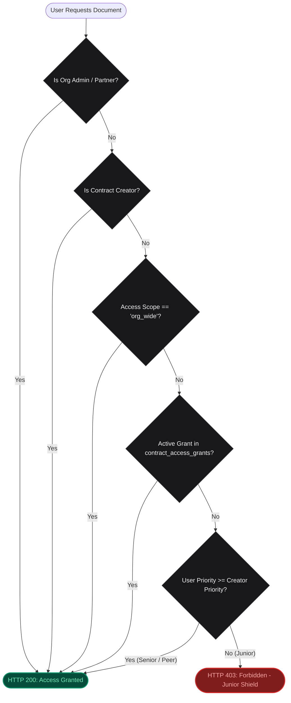
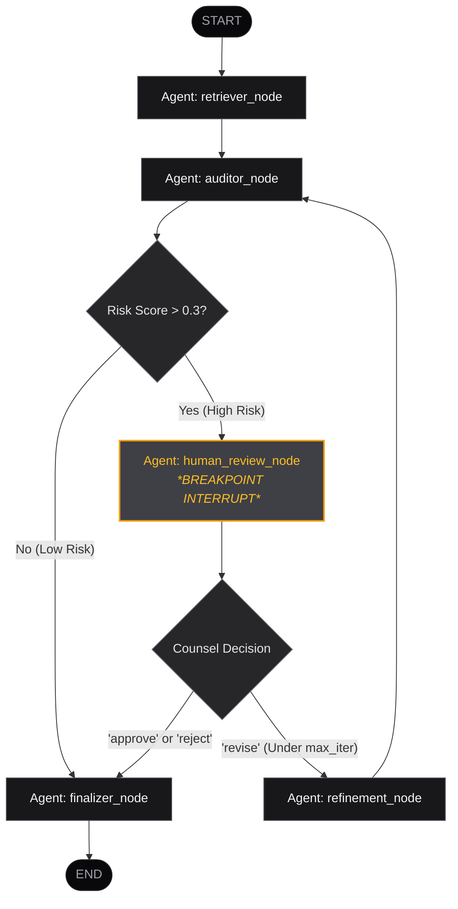

# Docusage Architecture Specification 🏛️

This document provides an exhaustive technical specification of **Docusage**, an enterprise-grade multi-agent contract compliance, legal risk assessment, and hierarchical security platform. It covers system topology, passwordless authentication, dual-token lifecycles, the custom Hierarchical Seniority RBAC engine, the LangGraph state machine, dense vector retrieval mechanics, ingestion pipelines, observability, and containerized deployment.

---

## 1. System Overview & Monorepo Topology

Docusage is architected as an isolated monorepo separating high-throughput Python AI/backend operations from modern React/Next.js frontend workflows:

```
docusage/
├── backend/                       # Python 3.12 FastAPI & LangGraph AI Service
│   ├── Dockerfile                 # Isolated backend container build
│   ├── .dockerignore              # Cache and volume exclusions
│   ├── requirements.txt           # Production Python dependencies
│   ├── pytest.ini                 # Backend-specific Pytest configuration
│   ├── src/backend/
│   │   ├── agents/
│   │   │   ├── analyzer.py        # LangGraph StateGraph, nodes, HITL engine
│   │   │   └── retriever.py       # Clause search & vector query interface
│   │   ├── app/
│   │   │   ├── main.py            # FastAPI entry point, lifespan, & routes
│   │   │   ├── config.py          # Pydantic BaseSettings environment config
│   │   │   ├── routes/            # auth, admin, contracts, policies, settings, metrics
│   │   │   ├── services/          # auth, rbac, provider_manager, contracts, policies
│   │   │   ├── models/            # Pydantic schemas (Request/Response)
│   │   │   └── utils/             # jwt, security (AES-256), db, logging, metrics, tracking
│   │   └── worker/
│   │       ├── celery_app.py      # Celery broker & result backend initialization
│   │       └── tasks.py           # Ingestion tasks (chunking & embeddings)
│   └── tests/                     # 48 Pytest, Hypothesis, and CRUD test suites
│
├── frontend/                      # Next.js 16 (App Router) TypeScript Client
│   ├── Dockerfile                 # Multi-stage production container build
│   ├── .dockerignore              # Node module and cache exclusions
│   ├── package.json               # Next.js, React 19, Tailwind, Vitest
│   ├── tailwind.config.ts         # Titanium & Zinc theme design tokens
│   ├── tsconfig.json
│   ├── vitest.config.ts
│   ├── src/
│   │   ├── app/                   # App Router pages (/login, /admin/roles, /contracts, /policies, /evals)
│   │   ├── components/            # Layout, Reviewer, AccessGrantModal, SettingsModal, DecisionDock
│   │   ├── lib/                   # Typed API client (api.ts) & utility helpers
│   │   └── types/                 # TypeScript interfaces
│   └── tests/                     # 14 Vitest unit tests + auth/admin workflows
│
├── scripts/
│   └── setup_db.sql               # PostgreSQL pgvector schema, roles, members, grants, seed
├── data/                          # Persistent raw contract storage (volume-mounted)
├── docker-compose.yml             # Orchestration for all 5 containerized services
├── pytest.ini                     # Root runner pointing pythonpath to backend
└── ARCHITECTURE.md           # Deep technical specification
```

---

## 2. Authentication & Dual-Token Security Architecture

Docusage implements a passwordless, token-based authentication system backed by **Resend** for email OTP delivery and cryptographic JSON Web Tokens (JWT).

### 2.1 Token Specifications

| Parameter | Access Token | Refresh Token | Email OTP |
| :--- | :--- | :--- | :--- |
| **Lifespan (TTL)** | **30 Minutes** (`1800s`) | **7 Days** (`604800s`) | **10 Minutes** (`600s`) |
| **Payload Claims** | `sub`, `email`, `org_id`, `role`, `priority`, `is_admin`, `type: "access"`, `iat`, `exp`, `jti` | `sub`, `family_id`, `type: "refresh"`, `iat`, `exp`, `jti` | 6-digit numeric string |
| **Hashing / Signature** | HS256 JWT Signature | HS256 JWT Signature | **Bcrypt** (Salt rounds = 12) |
| **Storage & Tracking** | Stateless Bearer header in client memory | Stored in PostgreSQL `refresh_tokens` table | Stored in PostgreSQL `auth_otp_codes` table |

### 2.2 Token Family Rotation & Replay Attack Defense

To prevent compromised refresh tokens from being perpetually reused:
1. Every successful refresh token exchange (`POST /auth/refresh`) invalidates the consumed refresh token (`is_revoked = TRUE`) and issues a new token pair containing the same `family_id`.
2. If a previously-consumed refresh token is presented again (replay attempt), the system flags the entire token family as compromised and revokes all tokens belonging to that `family_id`, requiring the user to re-authenticate via OTP.



---

## 3. Hierarchical Seniority-Based RBAC Engine

Docusage implements a mathematical, seniority-driven access control model where employee seniority priority automatically determines document visibility, supplemented by granular delegation overrides.

### 3.1 Mathematical Access Control Model

For any user $u$ requesting access to contract $c$ created by employee $u_{\text{creator}}$:

$$\text{CanView}(u, c) \iff \begin{cases} 
\text{True} & \text{if } u.\text{is\_admin} = \text{True} \lor u.\text{role} \in \{\text{"Partner"}, \text{"Admin"}\} \\
\text{True} & \text{if } u.\text{id} = c.\text{created\_by\_user\_id} \\
\text{True} & \text{if } c.\text{access\_scope} = \text{"org\_wide"} \\
\text{True} & \text{if } \exists g \in \text{Grants}(c, u) \text{ where } g.\text{expires\_at} > \text{now}() \\
\text{True} & \text{if } u.\text{priority} \ge u_{\text{creator}}.\text{priority} \\
\text{False} & \text{otherwise (HTTP 403 Forbidden)}
\end{cases}$$

### 3.2 Key Properties Verified by Hypothesis

1. **Senior Dominance (Top-Down Visibility):** For all $P_1 \ge P_2$, any employee with priority $P_1$ automatically possesses view and audit rights over documents created by employees with priority $P_2$.
2. **Junior Shield (Bottom-Up Restriction):** For all $P_1 < P_2$, an employee with priority $P_1$ is strictly forbidden from accessing documents created by employees with priority $P_2$ unless an explicit grant is active.
3. **Explicit Delegation Override:** Contract creators or seniors can grant specific delegation records (`contract_access_grants`) allowing junior employees temporary or permanent access, which can be revoked at any time.
4. **Admin Universal Access:** Administrators and Managing Partners maintain universal read/write access across all organization documents regardless of seniority scores.



---

## 4. Multi-Agent LangGraph State Machine

The compliance auditing intelligence is implemented using **LangGraph 1.2+** as a deterministic, check-pointed state machine.

### 4.1 State Schema (`ContractAnalysisState`)

```python
class ContractAnalysisState(TypedDict):
    contract_id: Union[str, int]             # Unique database UUID of the target contract
    policy_id: int                           # Target policy definition being audited
    thread_id: str                           # Isolated session checkpoint identifier
    rules: List[Dict[str, Any]]              # Policy covenants evaluated
    retrieved_clauses: Dict[str, List[str]]  # Semantic clauses mapped per rule
    deviations: List[Dict[str, Any]]         # Identified missing or non-compliant clauses
    risk_score: float                        # Calculated risk metric (0.0 to 1.0)
    status: str                              # Current state node tag
    human_action: Optional[str]              # 'approve' | 'reject' | 'revise' | None
    human_feedback: Optional[str]            # Guidance provided by legal counsel
    iteration_count: int                     # Number of refinement loops executed
    max_iterations: int                      # Upper boundary to prevent infinite looping
```

### 4.2 StateGraph Node Topology & Transitions



---

## 5. Document Ingestion & Vector Storage Pipeline

### 5.1 Multi-Format Extraction
- **PDF Documents**: Parsed with `pdfplumber`. Extracts text while preserving tables as markdown format.
- **DOCX Documents**: Parsed with `python-docx`. Iterates paragraphs and table cells sequentially.
- **Plain Text**: Read directly using UTF-8 decoding with fallback error replacement.

### 5.2 Embedding Model & Dense Vector Dimensions
- Uses **Sentence Transformers** `all-mpnet-base-v2` (`768` dimensions).
- Produces normalized dense vectors stored in PostgreSQL via the `pgvector` extension.

### 5.3 Database Schema ([`scripts/setup_db.sql`](file:///home/gagan-ahlawat/Projects/docusage/scripts/setup_db.sql))

```sql
CREATE EXTENSION IF NOT EXISTS "uuid-ossp";
CREATE EXTENSION IF NOT EXISTS "pgcrypto";
CREATE EXTENSION IF NOT EXISTS vector;

-- 1. Organizations
CREATE TABLE IF NOT EXISTS organizations (
    id UUID PRIMARY KEY DEFAULT gen_random_uuid(),
    name VARCHAR(255) NOT NULL,
    domain VARCHAR(255) UNIQUE,
    created_at TIMESTAMP DEFAULT NOW()
);

-- 2. Organization Roles (Hierarchical Priorities 1 - 100)
CREATE TABLE IF NOT EXISTS organization_roles (
    id SERIAL PRIMARY KEY,
    org_id UUID REFERENCES organizations(id) ON DELETE CASCADE,
    role_name VARCHAR(100) NOT NULL,
    priority INT NOT NULL CHECK (priority >= 1 AND priority <= 100),
    description TEXT,
    is_admin BOOLEAN DEFAULT FALSE,
    created_at TIMESTAMP DEFAULT NOW(),
    UNIQUE(org_id, role_name)
);

-- 3. Users & Members
CREATE TABLE IF NOT EXISTS users (
    id UUID PRIMARY KEY DEFAULT gen_random_uuid(),
    email VARCHAR(255) UNIQUE NOT NULL,
    name VARCHAR(255),
    created_at TIMESTAMP DEFAULT NOW()
);

CREATE TABLE IF NOT EXISTS organization_members (
    id SERIAL PRIMARY KEY,
    org_id UUID REFERENCES organizations(id) ON DELETE CASCADE,
    user_id UUID REFERENCES users(id) ON DELETE CASCADE,
    role_id INT REFERENCES organization_roles(id) ON DELETE CASCADE,
    custom_priority_override INT CHECK (custom_priority_override >= 1 AND custom_priority_override <= 100),
    joined_at TIMESTAMP DEFAULT NOW(),
    UNIQUE(org_id, user_id)
);

-- 4. Contracts with Access Scope
CREATE TABLE IF NOT EXISTS contracts (
    id UUID PRIMARY KEY DEFAULT gen_random_uuid(),
    name VARCHAR(255) NOT NULL,
    file_path VARCHAR(255) NOT NULL,
    metadata JSONB,
    org_id UUID REFERENCES organizations(id) ON DELETE CASCADE,
    created_by_user_id UUID REFERENCES users(id) ON DELETE SET NULL,
    access_scope VARCHAR(20) DEFAULT 'seniority',
    created_at TIMESTAMP DEFAULT NOW()
);

-- 5. Granular Delegation Overrides
CREATE TABLE IF NOT EXISTS contract_access_grants (
    id SERIAL PRIMARY KEY,
    contract_id UUID REFERENCES contracts(id) ON DELETE CASCADE,
    user_id UUID REFERENCES users(id) ON DELETE CASCADE,
    granted_by_user_id UUID REFERENCES users(id) ON DELETE SET NULL,
    permission_level VARCHAR(20) DEFAULT 'view',
    expires_at TIMESTAMP WITH TIME ZONE,
    granted_at TIMESTAMP DEFAULT NOW(),
    UNIQUE(contract_id, user_id)
);
```

---

## 6. Model Provider Manager & AES-256 Vault

Docusage supports flexible LLM and embedding providers with hardware-grade key protection:
- **Local Models via Ollama**: Discovers locally running Ollama models in real-time (`GET /api/tags`).
- **Cloud Providers**: Native integration with OpenAI, Anthropic, and Google Gemini.
- **AES-256 Key Vault**: Encrypts API keys using Fernet symmetric encryption with environment-derived encryption salts. Keys are always masked in UI responses (`sk-proj••••••••cdef`).

---

## 7. Observability, Metrics & Telemetry

- **Prometheus Exposition (`GET /metrics`)**:
  - `http_requests_total` (Counter): Tracks API request volumes by method, route, and status.
  - `contract_evaluations_total` (Counter): Tracks evaluations by audit outcome.
  - `rag_search_duration_seconds` (Histogram): Measures clause retrieval search latency.
- **MLflow Tracking**:
  - Logs audit runs, parameters (`contract_id`, `policy_id`, `deviations_count`), and metrics (`compliance_score`, `risk_score`).

---

## 8. Containerization & Deployment Orchestration

All 5 core services (`backend`, `celery`, `frontend`, `postgres`, `redis`) run via Docker Compose with health checks:
- **Hot-Reloading Volume Mounts**: `./backend/src:/app/src` and `./data:/app/data` mounted into backend containers for seamless local iteration.
- **Ordered Startup**: Backend and Celery depend on PostgreSQL and Redis achieving healthy state before starting.

---

## 9. Verification & Testing Standards

- **Backend Pytest Suite (48 Tests)**: Covers JWT lifecycles, Bcrypt OTP hashing, token family rotation, Resend email mocking, hierarchical RBAC integration, and Hypothesis property tests.
- **Frontend Vitest Suite (14 Tests)**: Covers authentication, role administration, reviewer workflows, and model provider configuration.
- **Next.js Production Build**: Zero compilation warnings or bundle errors.
